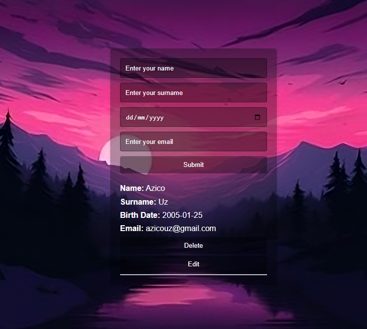

# CRUD App ✨



A simple **CRUD (Create, Read, Update, Delete)** app made with **HTML, CSS, and JavaScript**.  
It lets you add, edit, and delete user info — stored safely in your browser’s **LocalStorage**.  

---

## 📖 Table of Contents

- [English Version](#-english-version)
- [O‘zbekcha Versiya](#-o‘zbekcha-versiya)

---

## 🌍 English Version

### 📖 What is this project?

This project is a **CRUD (Create, Read, Update, Delete) app** made with **HTML, CSS, and JavaScript**.  
It allows you to **add, edit, and delete** user information such as:  
➡️ Name, Surname, Birth Date, and Email.  

Everything is saved in your browser’s **LocalStorage**, so your data won’t disappear even if you reload the page. 🚀  

### ✨ Features

- ➕ **Create** — Add new user info  
- 👀 **Read** — View stored data instantly  
- ✏️ **Update** — Edit existing records  
- ❌ **Delete** — Remove what you don’t need  
- 💾 **LocalStorage** — Keeps your data safe locally  
- 🎨 Stylish design with background & hover effects  

### 🛠️ Tech Stack

- 🧩 **HTML5** — structure & forms  
- 🎨 **CSS3** — styling & layout  
- ⚡ **JavaScript (ES6)** — interactivity & LocalStorage  

### 🚀 How to run?

```bash
# 1. Clone the repo
git clone https://github.com/USERNAME/CRUD-App.git

# 2. Go into the folder
cd CRUD-App

# 3. Open index.html in your browser
